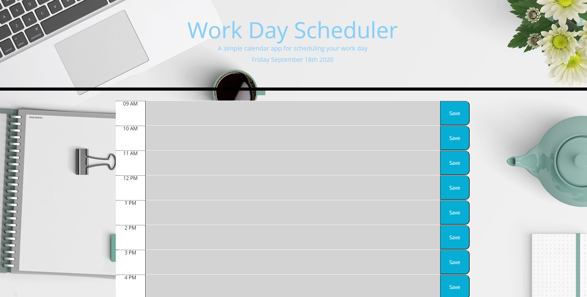

# Work Scheduler

### General Information
This is a calendar to save events on a time block on a typical work day of 9AM to 5PM. An event or plan can be typed into the text area and can be saved by clicking on the save button. 
The event is then saved into local storage and will persist even if the user refreshes the page. Each time block is color coded to help the user, the pink colored block indicates the present time, the grey colored block represents the past, and the green color block represents the future. 

### Technologies
- [JavaScript](https://www.javascript.com/)
- [Bootstrap](https://getbootstrap.com/)
- [Jquery](https://jquery.com/)

### Screen shots

### Author
- <a href="https://github.com/JSK321">Jae Kim</a>

### License
- MIT
